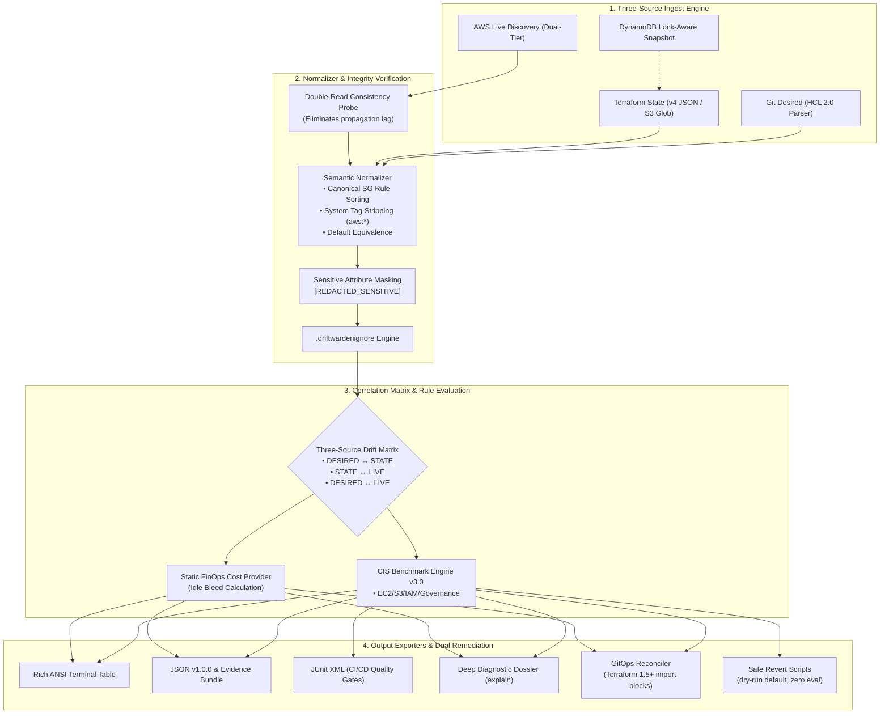
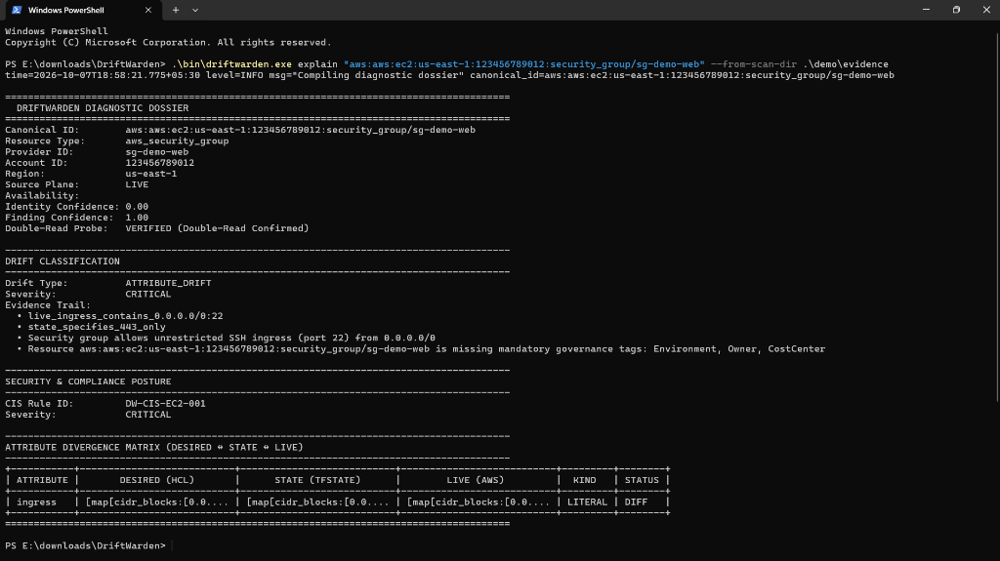
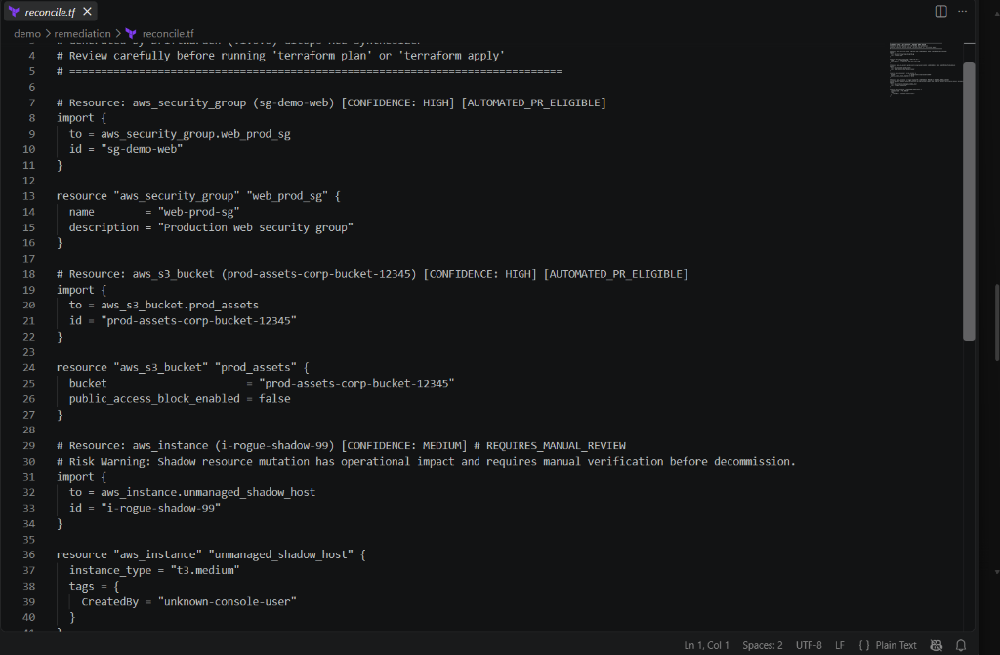
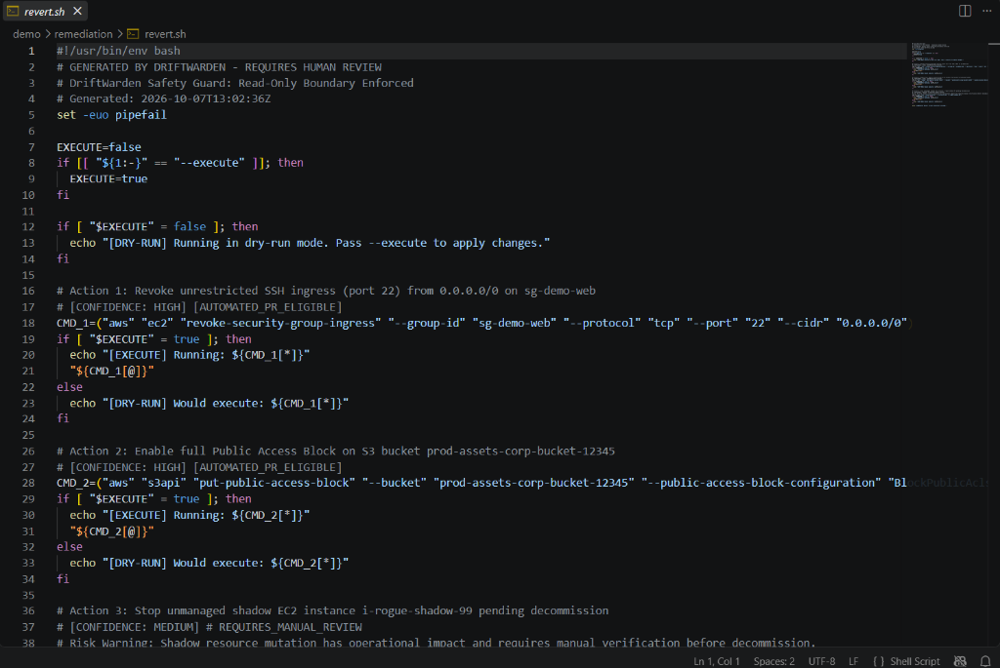
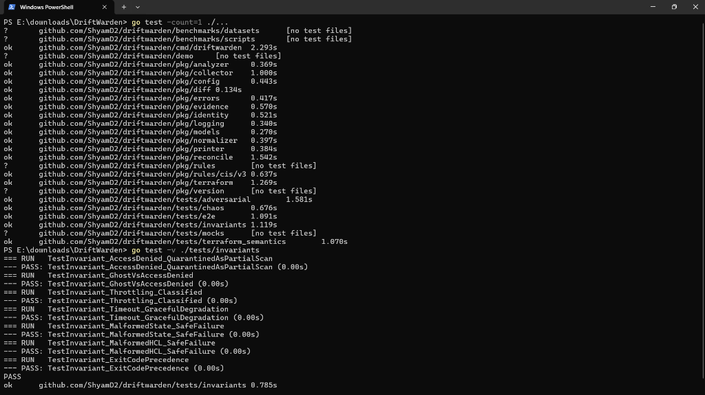
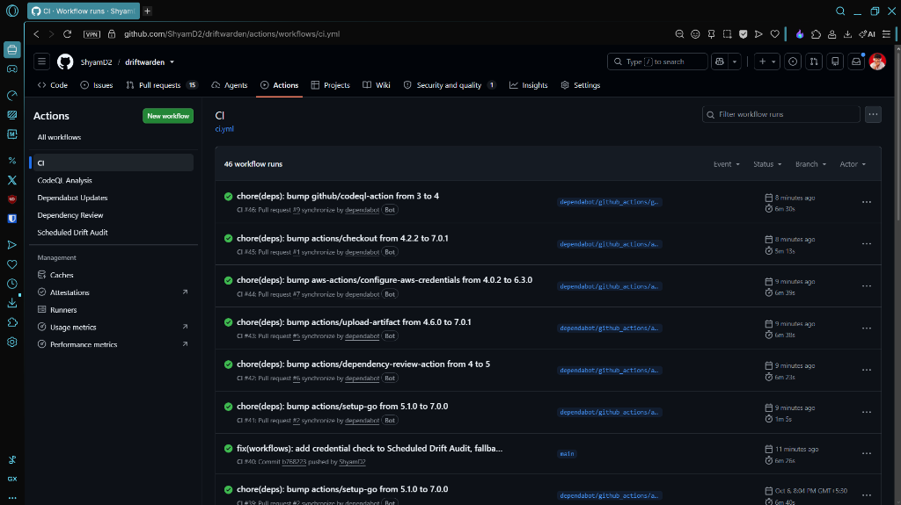

<div align="center">

```
  ____       _  __ _   __        __               _             
 |  _ \ _ __(_)/ _| |_ \ \      / /_ _ _ __ __| | ___ _ __   
 | | | | '__| | |_| __| \ \ /\ / / _` | '__/ _` |/ _ \ '_ \  
 | |_| | |  | |  _| |_   \ V  V / (_| | | | (_| |  __/ | | | 
 |____/|_|  |_|_|  \__|   \_/\_/ \__,_|_|  \__,_|\___|_| |_| 
```

### High-Precision Three-Source AWS Drift Detection, CIS Security Audit & GitOps Reconciliation Engine

[](https://github.com/ShyamD2/driftwarden/actions/workflows/ci.yml)
[](https://goreportcard.com/report/github.com/ShyamD2/driftwarden)
[](https://go.dev)
[](https://github.com/ShyamD2/driftwarden/pkgs/container/driftwarden)
[](pkg/rules/cis/v3)
[-FF6F00?style=flat-square&logo=adobe-acrobat-reader&logoColor=white)](docs/driftwarden-project-report.pdf)
[](LICENSE)
[](https://github.com/ShyamD2/driftwarden/pulls)

<p align="center">
  <a href="docs/driftwarden-project-report.pdf"><b>📄 Project Report (PDF)</b></a> •
  <a href="#-visual-tour--screenshots">Visual Tour</a> •
  <a href="#-the-three-source-architecture">Architecture</a> •
  <a href="#-key-features">Features</a> •
  <a href="#-golden-end-to-end-demonstration">Golden Demo</a> •
  <a href="#-quickstart">Quickstart</a> •
  <a href="#-cli-command-matrix">CLI Matrix</a> •
  <a href="#-comparison">Comparison</a> •
  <a href="#-hardware-honest-performance-benchmarks">Benchmarks</a> •
  <a href="#-github-action--cicd">CI/CD</a> •
  <a href="#-safety--security-invariants">Safety & Threat Model</a>
</p>

---

</div>

## 💡 The Blindspot in Modern Cloud Infrastructure

Traditional drift detection tools only inspect **Terraform State $\longleftrightarrow$ AWS Live State**.

This leaves an alarming blindspot: **Unapplied GitOps Changes**. When an engineer modifies `.tf` files in Git without applying them, state-only diffing reports zero drift—even as your actual declarative truth diverges from reality. Conversely, legacy scanners treat temporary API latency as true drift, triggering spurious alerts that cause alert fatigue.

**DriftWarden solves this with a deterministically verified Three-Source Correlation Matrix**:

$$\text{DESIRED (Git HCL)} \quad \longleftrightarrow \quad \text{STATE (Terraform tfstate)} \quad \longleftrightarrow \quad \text{LIVE (AWS Cloud)}$$

```
┌────────────────────────────────────────────────────────────────────────────────────────┐
│                        DRIFTWARDEN THREE-SOURCE SCAN REPORT                            │
├────────────────────────────────────────────────────────────────────────────────────────┤
│ Scan ID:     scan-0182749021                  Execution Time:   184 ms                 │
│ Account ID:  197550036081                     Regions Audited:  us-east-1, ap-south-1  │
│ Lock State:  DynamoDB Audited (Non-blocking)  Audit Status:     COMPLETE               │
│ Resources:   1,420 Scanned                    Drift Detected:   4 Discrepancies        │
└────────────────────────────────────────────────────────────────────────────────────────┘

┌───────────────────────────────────────────────┬────────────────────┬─────────────────┬──────────┬────────────┬────────────────┬───────────────┐
│ CANONICAL ID                                  │ TYPE               │ DRIFT TYPE      │ SEVERITY │ CONFIDENCE │ CIS RULE       │ MONTHLY WASTE │
├───────────────────────────────────────────────┼────────────────────┼─────────────────┼──────────┼────────────┼────────────────┼───────────────┤
│ aws:aws:ec2:us-east-1:197550036081:sec-group/…│ aws_security_group │ ATTRIBUTE_DRIFT │ CRITICAL │ 1.00       │ DW-CIS-EC2-001 │ -             │
│ aws:aws:s3:::bucket/rogue-shadow-bucket-prod  │ aws_s3_bucket      │ SHADOW_RESOURCE │ HIGH     │ 0.95       │ DW-CIS-S3-001  │ -             │
│ aws:aws:ec2:us-east-1:197550036081:instance/… │ aws_instance       │ SHADOW_RESOURCE │ HIGH     │ 1.00       │ DW-GOV-TAG-001 │ $60.74        │
│ aws:aws:ec2:us-east-1:197550036081:instance/… │ aws_instance       │ GHOST_RESOURCE  │ MEDIUM   │ 1.00       │ -              │ $0.00         │
└───────────────────────────────────────────────┴────────────────────┴─────────────────┴──────────┴────────────┴────────────────┴───────────────┘
```

---

## 🏛️ The Three-Source Architecture



---

## ⚡ Key Features

* 🎯 **Three-Source Correlation Matrix**: Detects not just standard drift, but **Unapplied Config Drift** (HCL updated but unapplied) and **Split-Brain Drift** (live modified while state also changed).
* 🛡️ **Built-in CIS Benchmark v3.0 Pack**:
  * `DW-CIS-EC2-001`: SSH (port 22) open to `0.0.0.0/0` (CRITICAL)
  * `DW-CIS-EC2-002`: RDP (port 3389) open to `0.0.0.0/0` (CRITICAL)
  * `DW-CIS-S3-001`: S3 Public Access Block disabled (CRITICAL)
  * `DW-CIS-S3-002`: S3 default server-side encryption missing (HIGH)
  * `DW-CIS-IAM-001`: Granular wildcard privilege escalation detection (`*` action/resource)
  * `DW-CIS-RDS-001`: Prohibit publicly accessible RDS instances (CRITICAL)
  * `DW-CIS-CT-001`: CloudTrail multi-region logging enabled (HIGH)
  * `DW-CIS-VPC-001`: Default security group restricts all traffic (HIGH)
  * `DW-CIS-KMS-001`: KMS customer master key rotation enabled (HIGH)
  * `DW-CIS-ECR-001`: ECR image scanning on push enabled (MEDIUM)
  * `DW-GOV-TAG-001`: Mandatory tagging enforcement (`Environment`, `Owner`, `CostCenter`)
* 💰 **FinOps On-Demand Cost Bleed Engine**: Computes exact hourly and monthly dollar waste for unmanaged rogue instances, orphaned EBS volumes, and idle unattached Elastic IPs.
* ⏱️ **Double-Read Consistency Probe**: Automatically re-probes anomalous resources after a configurable delay (`--verify-consistency-delay 2.5s`) to mitigate false alerts caused by AWS eventual consistency.
* 🔒 **Lock-Aware State Snapshots**: Audits S3-backed states protected by DynamoDB lock tables without deadlocking active CI/CD Terraform pipelines.
* 🏢 **Multi-Account AWS Organizations Fan-Out**: Automatically discovers all active member accounts in AWS Organizations and runs multi-threaded cross-account audits with token bucket rate limiting.
* 🛠️ **Capability-Aware Dual Remediation**:
  * **GitOps Mode**: Generates modern Terraform 1.5+ `import {}` blocks and resource skeletons with confidence scoring (`HIGH`, `MEDIUM`, `LOW`) and multi-layer boundary safeguards.
  * **Revert Mode**: Generates defensive remediation shell scripts (`revert.sh`), runbooks (`revert-plan.md`), and JSON payloads with **strict dry-run safety and zero `eval` execution**.

---

## 📸 Visual Tour & Core Showcase

Detailed screenshot walk-throughs and reproduction instructions are cataloged in [**screenshots/README.md**](screenshots/README.md).

| 1. Forensic Drift Dossier | 2. GitOps IaC Synthesis |
| :---: | :---: |
| [](screenshots/01-drift-detection-dossier.png)<br><sub>*Multi-plane divergence matrix & CIS audit (`driftwarden explain`)*</sub> | [](screenshots/02-gitops-remediation-hcl.png)<br><sub>*Modern Terraform 1.5+ `import {}` blocks (`driftwarden reconcile --mode hcl`)*</sub> |
| **3. Defensive Revert Script** | **4. Invariant Test Suite** |
| [](screenshots/03-defensive-revert-script.png)<br><sub>*Hardened bash with dry-run default & zero eval (`revert.sh`)*</sub> | [](screenshots/04-test-suite-and-invariants.png)<br><sub>*Live execution timings & invariant tests (`go test -v ./tests/invariants`)*</sub> |

<p align="center">
  <b>5. Production CI/CD Pipeline Verification</b><br>
  <a href="screenshots/05-github-actions-ci-pipeline.png">
    
  </a><br>
  <i>100% green multi-stage quality gates across module hygiene, static analysis, blocking vulnerability auditing, and multi-arch builds.</i>
</p>

---

## 🎬 Golden End-to-End Demonstration

DriftWarden includes a 100% reproducible, automated demonstration simulating live AWS console mutations against a compliant Terraform infrastructure baseline:

```
┌────────────────────────────────┐       ┌────────────────────────────────┐
│      DESIRED & STATE           │       │          LIVE AWS CLOUD        │
│  Terraform Configuration (Git) │  vs.  │  Console Operator Mutations    │
├────────────────────────────────┤       ├────────────────────────────────┤
│ 1. SG: Ingress port 443 ONLY   │       │ 1. SG: Port 22 added (0.0.0.0) │ -> CRITICAL (DW-CIS-EC2-001)
│ 2. S3: Public Access Block ON  │       │ 2. S3: Public Access Block OFF │ -> CRITICAL (DW-CIS-S3-001)
│ 3. EC2: None declared          │       │ 3. EC2: Rogue t3.medium active │ -> SHADOW ($60.74/mo bleed)
└────────────────────────────────┘       └────────────────────────────────┘
```

### Reproduce in Under 5 Seconds

No live AWS credentials or cloud costs required:

```bash
# On Linux / macOS:
./demo/run_demo.sh

# On Windows PowerShell:
.\demo\run_demo.ps1
```

The script audits the simulated mutations, detects all discrepancies, verifies CIS benchmark violations, creates full evidence bundles with SHA-256 manifests, and synthesizes GitOps PR import blocks and defensive `revert.sh` scripts.

For full walkthrough details, see [**demo/README.md**](demo/README.md).

---

## 🚀 Quickstart

### Installation

#### Via Homebrew (macOS / Linux)
```bash
brew tap ShyamD2/tap
brew install driftwarden
```

#### Via Go Install (Go 1.24+)
```bash
go install github.com/ShyamD2/driftwarden/cmd/driftwarden@latest
```

#### Via Docker (Distroless < 25MB)
```bash
docker pull ghcr.io/shyamd2/driftwarden:latest

docker run --rm \
  -v ~/.aws:/home/nonroot/.aws:ro \
  -v $(pwd):/workspace:ro \
  ghcr.io/shyamd2/driftwarden:latest scan \
    --hcl-dir /workspace \
    --tfstate /workspace/terraform.tfstate \
    --regions us-east-1
```

#### Pre-Compiled Release Binaries
Download signed binaries for Linux (`amd64`, `arm64`), macOS (`Apple Silicon`, `Intel`), and Windows from [GitHub Releases](https://github.com/ShyamD2/driftwarden/releases).

---

## 🎮 CLI Command Matrix

DriftWarden features a strictly defined 9-subcommand CLI architecture:

| Command | Description | Typical Use Case |
|---|---|---|
| [`driftwarden scan`](#1-driftwarden-scan) | Complete three-source audit (HCL ↔ State ↔ AWS) | CI/CD scheduled pipelines & drift detection |
| [`driftwarden shadow`](#2-driftwarden-shadow) | Discovers strictly unmanaged rogue assets | Incident response & ghost asset discovery |
| [`driftwarden security`](#3-driftwarden-security) | Evaluates CIS AWS Foundations Benchmark compliance | Cloud security posture management (CSPM) |
| [`driftwarden explain`](#4-driftwarden-explain) | Compiles deep multi-section diagnostic dossier | Deep debugging single resource divergence |
| [`driftwarden reconcile`](#5-driftwarden-reconcile) | Synthesizes GitOps HCL or defensive revert script | Remediation workflow & auto-PR generation |
| [`driftwarden check-permissions`](#6-driftwarden-check-permissions) | Simulates required read-only AWS IAM permissions | Pre-flight audit credential validation |
| [`driftwarden generate-iam-policy`](#7-driftwarden-generate-iam-policy) | Synthesizes strictly minimal read-only IAM policy | Least-privilege IAM role provisioning |
| [`driftwarden doctor`](#8-driftwarden-doctor) | Environment diagnostics & LocalStack health check | Local troubleshooting & setup verification |
| [`driftwarden version`](#9-driftwarden-version) | Prints version, commit hash, and compiler details | Build verification & debugging |

---

### Command Walkthroughs

#### 1. `driftwarden scan`
Performs full three-source reconciliation across local files, S3 state backends, and live AWS APIs:
```bash
driftwarden scan \
  --hcl-dir ./infra \
  --tfstate ./infra/terraform.tfstate \
  --regions us-east-1,ap-south-1 \
  --save-evidence-dir ./evidence \
  --fail-on-critical
```

#### 2. `driftwarden shadow`
Isolates resources existing in AWS but completely absent from Terraform configuration:
```bash
driftwarden shadow \
  --regions us-east-1 \
  --format table \
  --fail-on-drift
```

#### 3. `driftwarden security`
Scans live resources and drift findings for CIS AWS Foundations Benchmark violations:
```bash
driftwarden security \
  --regions us-east-1 \
  --benchmark-version v3.0 \
  --fail-on-critical
```

#### 4. `driftwarden explain`
Generates a complete forensic dossier for a specific canonical resource ID (supports offline audit from saved evidence bundles):
```bash
driftwarden explain "aws:aws:ec2:us-east-1:197550036081:instance/i-0a1b2c3d4e5f67890" \
  --from-scan-dir ./evidence
```

> [!NOTE]
> 📸 **Visual Showcase**: See the terminal output of a multi-plane divergence matrix in [`screenshots/01-drift-detection-dossier.png`](screenshots/01-drift-detection-dossier.png).

#### 5. `driftwarden reconcile`
Generates safe remediation artifacts:
```bash
# GitOps Mode: Generates Terraform 1.5+ modern import blocks
driftwarden reconcile --mode hcl --out ./reconcile.tf

# Revert Mode: Generates dry-run shell script and markdown action plan
driftwarden reconcile --mode revert --out ./remediation/
```

> [!TIP]
> 📸 **Artifact Previews**: Inspect generated [Terraform 1.5+ `reconcile.tf`](screenshots/02-gitops-remediation-hcl.png) and hardened defensive [`revert.sh`](screenshots/03-defensive-revert-script.png).

#### 6. `driftwarden generate-iam-policy`
Synthesizes the exact, least-privilege read-only AWS IAM policy needed to audit selected services:
```bash
driftwarden generate-iam-policy --services ec2,s3,iam > driftwarden-readonly-policy.json
```

---

## 🛡️ The `.driftwardenignore` Engine

Exclude intentional anomalies, ephemeral test resources, or external automation tags using `.driftwardenignore` at your workspace root:

```gitignore
# Ignore entire resource types in specific regions
aws:aws:ec2:us-west-2:*:security_group/*

# Ignore ephemeral spot instances by tag pattern
tags.Environment=testing
tags.Lifecycle=spot-ephemeral

# Suppress noisy computed attribute diffs
*.attributes.latest_restorable_time
aws_s3_bucket.attributes.tags_all
```

---

## 🤖 GitHub Action & CI/CD Integration

DriftWarden includes a production-hardened GitHub Action with automated pull request commenting:

```yaml
name: Infrastructure Drift & Security Audit

on:
  schedule:
    - cron: '0 6 * * *' # Daily at 06:00 UTC
  pull_request:
    branches: [ main ]

jobs:
  audit:
    runs-on: ubuntu-latest
    permissions:
      id-token: write
      contents: read
      pull-requests: write

    steps:
      - name: Checkout Code
        uses: actions/checkout@v4

      - name: Configure AWS Credentials (OIDC)
        uses: aws-actions/configure-aws-credentials@v4
        with:
          role-to-assume: ${{ secrets.AWS_DRIFTWARDEN_ROLE_ARN }}
          aws-region: us-east-1

      - name: Run DriftWarden Audit
        uses: ShyamD2/driftwarden@v1
        with:
          tfstate: 'terraform.tfstate'
          hcl-dir: '.'
          regions: 'us-east-1'
          fail-on-critical: 'true'
          comment-pr: 'true'
```

> [!NOTE]
> 📸 **Continuous Integration Status**: DriftWarden's automated multi-stage quality gates and multi-arch compilation are strictly verified green on GitHub Actions: [View Pipeline Verification Run](screenshots/05-github-actions-ci-pipeline.png).

---

## 📊 Comparison Matrix

| Feature Dimension | `terraform plan` | `driftctl` | AWS Config | **DriftWarden** |
|---|:---:|:---:|:---:|:---:|
| **Reconciliation Model** | Desired $\leftrightarrow$ State | State $\leftrightarrow$ Live | Live Rules Only | **Desired $\leftrightarrow$ State $\leftrightarrow$ Live (3-Source)** |
| **Shadow Resource Detection** | ❌ No | ✅ Yes | ⚠️ Complex | **✅ Yes (Dual-Tier Discovery)** |
| **Unapplied HCL Drift** | ⚠️ Plan Only | ❌ No | ❌ No | **✅ Yes (`UNAPPLIED_CONFIG_DRIFT`)** |
| **Split-Brain Drift Detection** | ❌ No | ❌ No | ❌ No | **✅ Yes (`SPLIT_BRAIN_DRIFT`)** |
| **DynamoDB Lock-Aware** | ❌ Hard Lock Block | ❌ Hard Lock Block | N/A | **✅ Yes (Non-blocking Lock Audit)** |
| **CIS v3.0 Benchmark Engine** | ❌ No | ❌ No | ⚠️ Pay-per-rule | **✅ Built-in (`DW-CIS-*` Engine)** |
| **FinOps Idle Cost Estimator** | ❌ No | ❌ No | ❌ No | **✅ Built-in ($/month bleed)** |
| **Double-Read Consistency Probe** | ❌ No | ❌ No | ❌ No | **✅ Yes (Configurable Double-Read Verification)** |
| **Modern Terraform 1.5+ Imports** | ❌ No | ❌ No (tf 0.13) | ❌ No | **✅ Yes (`import {}` block synthesis)** |
| **Defensive Dry-Run Revert Scripts** | ❌ No | ❌ No | ❌ No | **✅ Yes (`revert.sh` with zero eval)** |
| **Container Image Size** | N/A | ~85 MB | Cloud SaaS | **`< 25 MB` Distroless Static** |

---

## 🏎️ Hardware-Honest Performance Benchmarks

Measured using automated benchmark suites on commodity hardware (**11th Gen Intel Core i3-1115G4 @ 3.00GHz, 4 vCPUs, Go 1.27**):

| Benchmark Suite | Scale (Resources) | Target SLA | Median Time | P95 Time | Peak Heap Alloc | SLA Compliance |
|---|:---:|:---:|:---:|:---:|:---:|:---:|
| **`BenchmarkStateParsing`** | 1,000 | $< 50.0\text{ ms}$ | **$7.53\text{ ms}$** | $10.47\text{ ms}$ | $2.34\text{ MB}$ | **$6.6\times\text{ faster than SLA}$** |
| **`BenchmarkStateParsing`** | 10,000 | $< 500.0\text{ ms}$ | **$66.68\text{ ms}$** | $75.57\text{ ms}$ | $28.48\text{ MB}$ | **$7.5\times\text{ faster than SLA}$** |
| **`BenchmarkSemanticDiffing`** | 1,000 | $< 10.0\text{ ms}$ | **$1.59\text{ ms}$** | $3.55\text{ ms}$ | $0.27\text{ MB}$ | **$6.3\times\text{ faster than SLA}$** |
| **`BenchmarkSemanticDiffing`** | 10,000 | $< 100.0\text{ ms}$ | **$20.60\text{ ms}$** | $29.99\text{ ms}$ | $2.53\text{ MB}$ | **$4.8\times\text{ faster than SLA}$** |

### Reproducing Benchmarks Locally

Reproduce the exact benchmark harness on your local machine:

```bash
make benchmark
```

Full methodology, iteration count, and raw execution telemetry are tracked in [**benchmarks/README.md**](benchmarks/README.md) and [**benchmarks/results/benchmark-2026-10.md**](benchmarks/results/benchmark-2026-10.md).

---

## 🔒 Safety & Security Guarantees

1. **Strict Read-Only Guarantee**: DriftWarden only executes `Describe*`, `List*`, and `Get*` API calls. Destructive or mutating cloud operations are architecturally prohibited within the core binary. Mechanically verified in CI via automated AST static analysis (`tests/adversarial/readonly_enforcement_test.go`).
2. **AccessDenied Invariant**: Permission errors (`ErrAccessDenied`) are strictly quarantined as `PARTIAL_SCAN` (exit code 4) and are never falsely classified as `ErrNotFound`, preventing spurious ghost-resource warnings.
3. **Sensitive Data Masking**: All passwords, secret tokens, private keys, and auth attributes are masked to `[REDACTED_SENSITIVE]` prior to comparison, logging, or export.
4. **Defensive Revert Script Integrity**: Revert scripts synthesized by `driftwarden reconcile --mode revert` strictly prohibit `eval`, default to `EXECUTE=false` echo-only mode, and enforce `set -euo pipefail`.
5. **Deterministic Exit Codes**:
   * `0`: Clean scan (Zero drift / zero violations)
   * `1`: General runtime error
   * `2`: Drift detected
   * `3`: Security rule violation detected
   * `4`: Partial scan (Quarantined `AccessDenied` resources)

> [!TIP]
> 📸 **Verified Invariant Test Telemetry**: Live test execution and adversarial invariant tests pass with 100% success rate: [View Invariant Test Suite Telemetry](screenshots/04-test-suite-and-invariants.png).

### Security Documentation & Specifications
* 📑 [**DriftWarden Project Report (Edition 2026)**](docs/driftwarden-project-report.pdf) — Complete 20-page engineering report detailing the three-source correlation matrix, pipeline architecture, CIS benchmark engine, empirical hardware benchmarks, and verified live proofs.
* 🛡️ [**Security Model & Verification Matrix**](docs/security-model.md) — Comprehensive threat defense matrix verified by automated adversarial tests.
* 🔍 [**STRIDE Threat Model**](docs/threat-model.md) — Threat actor taxonomy, attack surfaces, and mitigations.
* 📐 [**Normalization Contract Specification**](docs/normalization-spec.md) — Formal specification of 8 core normalization invariants (ordering, type safety, null-awareness, default-equivalence, system tags, sensitive masking, idempotency, determinism).
* 📦 [**Forensic Evidence Format**](docs/evidence-format.md) — Specification for SHA-256 evidence bundles and provenance records.
* 🏷️ [**Versioning & Compatibility Policy**](docs/versioning-policy.md) — SemVer 2.0.0, CLI flag stability, and machine schema guarantees.
* 📜 [**Changelog & Release Notes**](CHANGELOG.md) — Release notes and history adhering to Keep a Changelog.

---

## 🤝 Contributing

Contributions are warmly welcomed! Please review our [Contribution Guidelines](CONTRIBUTING.md) and [Code of Conduct](CODE_OF_CONDUCT.md).

```bash
# Clone the repository
git clone https://github.com/ShyamD2/driftwarden.git
cd driftwarden

# Run tests and invariant verifications
make test
go test -v ./tests/...

# Run property & fuzz tests
make fuzz

# Run performance benchmarks
make benchmark
```

---

## 📄 License

DriftWarden is licensed under the **Apache License 2.0**. See [LICENSE](LICENSE) for the full license text.
