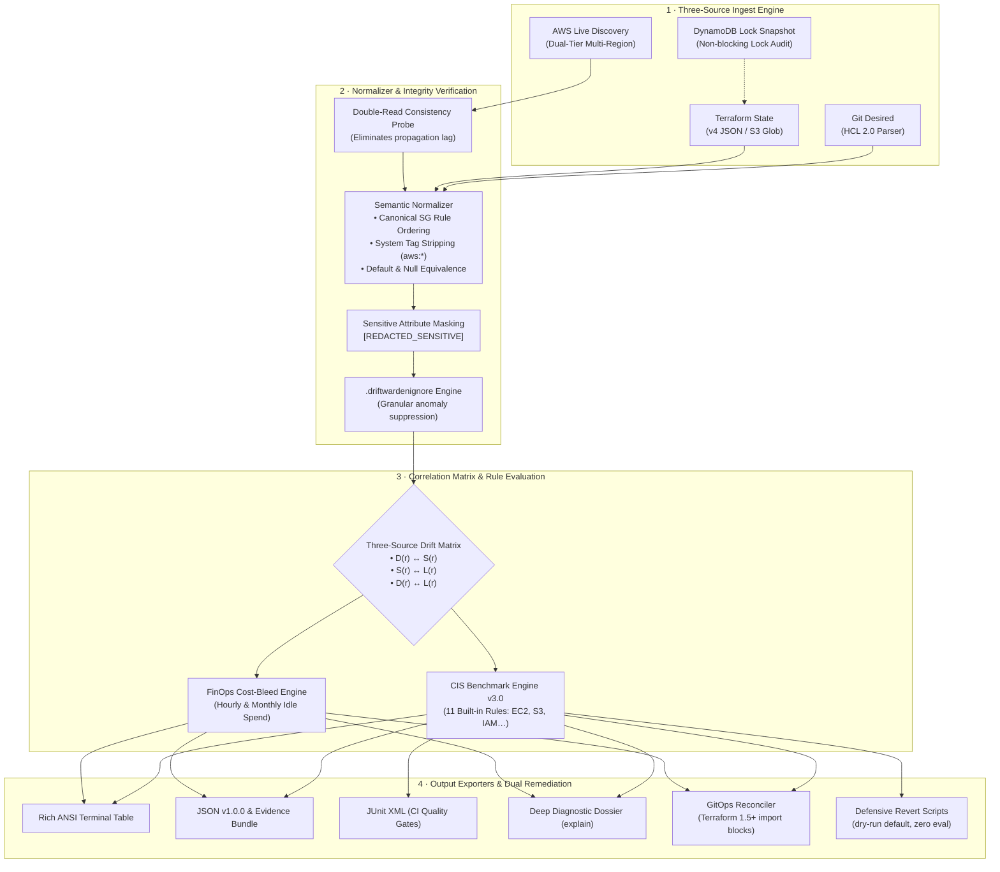

<div align="center">

```
  ____       _  __ _   __        __               _             
 |  _ \ _ __(_)/ _| |_ \ \      / /_ _ _ __ __| | ___ _ __   
 | | | | '__| | |_| __| \ \ /\ / / _` | '__/ _` |/ _ \ '_ \  
 | |_| | |  | |  _| |_   \ V  V / (_| | | | (_| |  __/ | | | 
 |____/|_|  |_|_|  \__|   \_/\_/ \__,_|_|  \__,_|\___|_| |_| 
```

### High-Precision Three-Source AWS Drift Detection, CIS Security Audit & GitOps Reconciliation Engine

[](https://github.com/ShyamD2/driftwarden/actions/workflows/ci.yml)
[](https://goreportcard.com/report/github.com/ShyamD2/driftwarden)
[](https://go.dev)
[](https://github.com/ShyamD2/driftwarden/pkgs/container/driftwarden)
[](pkg/rules/cis/v3)
[-FF6F00?style=flat-square&logo=adobe-acrobat-reader&logoColor=white)](docs/driftwarden-project-report.pdf)
[](LICENSE)
[](https://github.com/ShyamD2/driftwarden/pulls)

<p align="center">
  <a href="docs/driftwarden-project-report.pdf"><b>📄 Project Report (PDF)</b></a> •
  <a href="#-executive-summary">Executive Summary</a> •
  <a href="#-the-blindspot-in-state-only-tools">The Problem</a> •
  <a href="#-the-three-source-architecture">Architecture</a> •
  <a href="#-visual-tour--core-showcase">Visual Tour</a> •
  <a href="#-cis-benchmark-pack--finops-bleed">CIS & FinOps</a> •
  <a href="#-golden-end-to-end-demonstration">Golden Demo</a> •
  <a href="#-quickstart">Quickstart</a> •
  <a href="#-cli-command-matrix">CLI Matrix</a> •
  <a href="#-comparison-matrix">Comparison</a> •
  <a href="#-hardware-honest-performance-benchmarks">Benchmarks</a> •
  <a href="#-safety--security-guarantees">Safety Guarantees</a>
</p>

---

</div>

## 📌 Executive Summary

DriftWarden answers a deceptively simple question: **Do Git, Terraform state, and live AWS still agree?** — and answers it with cryptographic evidence.

It is a read-only Go engine that correlates all three sources simultaneously, re-verifies live anomalies with a double-read probe before reporting them, audits findings against a built-in CIS AWS Foundations Benchmark v3.0 rule pack, prices idle infrastructure waste in exact dollar amounts, and produces reviewable GitOps pull requests or dry-run revert scripts before anything touches your cloud.

```
┌─────────────────────────┬─────────────────────────┬─────────────────────────┬─────────────────────────┬─────────────────────────┐
│       3 SOURCES         │     5 DRIFT CLASSES     │     11 AUDIT RULES      │     9 CLI COMMANDS      │   0 MUTATING AWS CALLS  │
│  Git ↔ State ↔ Live AWS │ Unapplied, Split-Brain… │  CIS v3.0 + Governance  │ Ingest to Remediation   │ Mechanically Enforced   │
└─────────────────────────┴─────────────────────────┴─────────────────────────┴─────────────────────────┴─────────────────────────┘
```

| Dimension | The Industry Problem | DriftWarden's Approach | The Production Outcome |
| :--- | :--- | :--- | :--- |
| **Reconciliation** | State-only tools compare state ↔ live; unapplied HCL and shadow assets either slip through or trigger spurious alerts. | **Three-Source Correlation Matrix** evaluating Desired ↔ State ↔ Live in a single pass. | Zero blindspots. Detects unapplied Git changes, shadow assets, and split-brain drift in milliseconds. |
| **Alert Integrity** | Eventual consistency and API propagation lag drown engineering teams in false alerts. | **Double-Read Consistency Probe** (`--verify-consistency-delay 2.5s`) and semantic normalizer. | Flake-free alerting. Transient AWS API lags are eliminated before raising notifications. |
| **Security & Cost** | Security scans and FinOps audits are decoupled from infrastructure drift lifecycles. | **Built-in CIS v3.0 Engine** and **FinOps Cost-Bleed Engine** pricing idle spend. | Instant context: each drifted asset is annotated with its CIS security violation and monthly cost leak. |
| **Remediation** | Automated fix tools execute destructive mutations silently against production accounts. | **Capability-Aware Dual Remediation**: Declarative Terraform 1.5+ `import {}` blocks or dry-run `revert.sh`. | Human-in-the-loop review. Zero silent mutations; strict zero-`eval` shell safety. |

---

## 💡 The Blindspot in State-Only Tools

Traditional drift detection tools only inspect **Terraform State $\longleftrightarrow$ AWS Live State**.

That leaves a dangerous blindspot: when an engineer edits `.tf` files in Git but never applies them, state-only diffing reports **zero drift** even though declared intent and live reality have diverged. In the other direction, legacy scanners treat temporary AWS API latency as true drift, flooding on-call engineers with spurious noise until real security findings are ignored.

### The Building-Inspector Analogy

Imagine inspecting a physical skyscraper against three sources:
1. **The Architect's Blueprint** (Git HCL) — What should exist.
2. **The City Permit Register** (Terraform State) — What was approved and recorded.
3. **The Building Itself** (Live AWS) — What actually stands.

| Inspection Model | Cloud Equivalent | What It Catches | What It Misses |
| :--- | :--- | :--- | :--- |
| **Compares Register $\longleftrightarrow$ Building only** | State $\longleftrightarrow$ Live *(Legacy tools)* | Edits made directly on site. | Changes recorded on the blueprint that never reached the permit register; unmanaged additions. |
| **Compares Blueprint $\longleftrightarrow$ Register $\longleftrightarrow$ Building** | **Desired $\longleftrightarrow$ State $\longleftrightarrow$ Live *(DriftWarden)*** | **Everything**: Unapplied plans, extra floors nobody approved, doors left unlocked — and re-checks before sounding the alarm. | **Zero blindspots.** |

> *"DriftWarden doesn't just ask whether the cloud changed. It asks whether Git, state, and reality still agree — and proves it before raising an alert."*

---

## 🏛️ The Three-Source Architecture



### Formal Mathematical Classification Model

$$\text{Drift}(r) = \text{classify}\Big( D(r) \longleftrightarrow S(r), \; S(r) \longleftrightarrow L(r), \; D(r) \longleftrightarrow L(r) \Big) \quad \text{after} \quad \text{normalize} \circ \text{mask} \circ \text{verify}$$

Where $D(r)$ is desired Git HCL, $S(r)$ is Terraform state snapshot, and $L(r)$ is live AWS state confirmed by the double-read probe. Comparison is only performed on values passing the eight formal normalization invariants (ordering, type coercion, null-awareness, default equivalence, system tags, sensitive masking, idempotency, and determinism).

### Why a Third Source Changes Everything

| Drift Class | What Happened | Why State-Only Tools Miss It |
| :--- | :--- | :--- |
| **`UNAPPLIED_CONFIG_DRIFT`** | HCL was updated in Git but never applied to state/cloud. | State and live still agree — a two-way diff reports a clean state. |
| **`SPLIT_BRAIN_DRIFT`** | Live cloud was modified while state also changed independently. | Neither side is simply "right"; requires all three views to resolve. |
| **`SHADOW_RESOURCE`** | Exists in live AWS, completely absent from Git and state. | Not tracked in state, so state-only tools never query or compare it. |
| **`GHOST_RESOURCE`** | Declared in Git and state, but missing from live AWS. | Must be strictly separated from `AccessDenied` errors to avoid false alerts. |
| **`ATTRIBUTE_DRIFT`** | A managed attribute differs from declared configuration. | Requires semantic normalization to eliminate cosmetic diffs. |

---

## 📸 Visual Tour & Core Showcase

Detailed screenshot walk-throughs and reproduction instructions are cataloged in [**screenshots/README.md**](screenshots/README.md).

| 1. Forensic Drift Dossier | 2. GitOps IaC Synthesis |
| :---: | :---: |
| [](screenshots/01-drift-detection-dossier.png)<br><sub>*Multi-plane divergence matrix & CIS audit (`driftwarden explain`)*</sub> | [](screenshots/02-gitops-remediation-hcl.png)<br><sub>*Modern Terraform 1.5+ `import {}` blocks (`driftwarden reconcile --mode hcl`)*</sub> |
| **3. Defensive Revert Script** | **4. Invariant Test Suite** |
| [](screenshots/03-defensive-revert-script.png)<br><sub>*Hardened bash with dry-run default & zero eval (`revert.sh`)*</sub> | [](screenshots/04-test-suite-and-invariants.png)<br><sub>*Live execution timings & invariant tests (`go test -v ./tests/invariants`)*</sub> |

<p align="center">
  <b>5. Production CI/CD Pipeline Verification</b><br>
  <a href="screenshots/05-github-actions-ci-pipeline.png">
    
  </a><br>
  <i>100% green multi-stage quality gates across module hygiene, static analysis, blocking vulnerability auditing, and multi-arch builds.</i>
</p>

---

## 👥 Who Benefits

<div align="center">

| Platform & DevOps Engineers | Security & Compliance Teams | FinOps & Engineering Managers | SRE & On-Call Engineers |
| :--- | :--- | :--- | :--- |
| Know immediately when Git, state, and AWS diverge. Receive automated Terraform 1.5+ `import {}` blocks to bring rogue assets under control. | Continuous CIS v3.0 benchmark evaluation with rule IDs, severity ratings, and evidence trails exported as JUnit XML or JSON. | Dollar-denominated idle cost bleed per rogue resource turns messy cleanup into an objective, prioritized engineering backlog. | Deep single-resource forensic dossiers (`explain`) plus safe revert scripts that do nothing until explicitly told to. |

</div>

---

## 🛡️ CIS Benchmark Pack & FinOps Bleed

DriftWarden includes a built-in evaluation engine for the **CIS AWS Foundations Benchmark v3.0** and mandatory governance tag compliance:

| Rule ID | Target Control | Severity | Automated Remediation Target |
| :--- | :--- | :---: | :--- |
| **`DW-CIS-EC2-001`** | SSH (port 22) open to `0.0.0.0/0` | **`CRITICAL`** | Revoke open security group ingress |
| **`DW-CIS-EC2-002`** | RDP (port 3389) open to `0.0.0.0/0` | **`CRITICAL`** | Revoke open security group ingress |
| **`DW-CIS-S3-001`** | S3 Public Access Block disabled | **`CRITICAL`** | Enable all 4 public access block settings |
| **`DW-CIS-S3-002`** | S3 default server-side encryption missing | **`HIGH`** | Apply AES256 / AWS-KMS default encryption |
| **`DW-CIS-IAM-001`** | Wildcard (`*`) privilege-escalation detection | **`HIGH`** | Flag dangerous IAM statements for least-privilege scoping |
| **`DW-CIS-RDS-001`** | Publicly accessible RDS instance prohibited | **`CRITICAL`** | Set `publicly_accessible = false` |
| **`DW-CIS-CT-001`** | CloudTrail multi-region logging enabled | **`HIGH`** | Enforce multi-region trail configuration |
| **`DW-CIS-VPC-001`** | Default security group restricts all traffic | **`HIGH`** | Revoke default VPC SG ingress/egress rules |
| **`DW-CIS-KMS-001`** | KMS customer master key rotation enabled | **`HIGH`** | Enable automatic annual key rotation |
| **`DW-CIS-ECR-001`** | ECR image scanning on push enabled | **`MEDIUM`** | Set `image_scanning_configuration.scan_on_push = true` |
| **`DW-GOV-TAG-001`** | Mandatory tags: `Environment`, `Owner`, `CostCenter` | **`HIGH`** | Quarantine untagged infrastructure assets |

```
┌─────────────────────────────────┬─────────────────────────────────┬─────────────────────────────────┐
│          CRITICAL · 4           │            HIGH · 6             │           MEDIUM · 1            │
│  EC2 Ingress, S3 PAB, RDS Public│  S3 Encrypt, IAM, KMS, CT, VPC… │       ECR Scan on Push          │
└─────────────────────────────────┴─────────────────────────────────┴─────────────────────────────────┘
```

### Specialized Engine Capabilities

* 💰 **FinOps Cost-Bleed Engine**: Prices unmanaged rogue instances, orphaned EBS volumes, and idle unattached Elastic IPs in exact hourly and monthly dollars (e.g., rogue `t3.medium` shadow host at **\$60.74/month**).
* ⏱️ **Double-Read Consistency Probe**: Re-probes anomalous resources after a configurable delay (`--verify-consistency-delay 2.5s`) so AWS eventual consistency propagation lag never generates a false alarm.
* 🔒 **Lock-Aware State Snapshots**: Reads S3-backed state guarded by DynamoDB lock tables without taking the lock — audits never deadlock active Terraform execution pipelines.
* 🏢 **AWS Organizations Fan-Out**: Automatically discovers active member accounts and executes multi-threaded cross-account audits with token-bucket rate limiting.

---

## 🎬 Golden End-to-End Demonstration

DriftWarden includes a 100% reproducible, automated demonstration simulating live AWS console mutations against a compliant Terraform infrastructure baseline:

| Monitored Resource | Desired & State (Git / tfstate) | Live AWS Console Mutation | DriftWarden Finding |
| :--- | :--- | :--- | :--- |
| **Security Group** | Ingress port 443 only | Port 22 opened to `0.0.0.0/0` | **`CRITICAL`** (`DW-CIS-EC2-001`) |
| **S3 Bucket** | Public Access Block ON | Public Access Block turned OFF | **`CRITICAL`** (`DW-CIS-S3-001`) |
| **EC2 Instance** | None declared *(zero state)* | Rogue `t3.medium` launched | **`SHADOW_RESOURCE`** (**\$60.74/mo bleed**) |

### Reproduce in Under 5 Seconds

Zero live AWS credentials or cloud costs required:

```bash
# On Linux / macOS:
./demo/run_demo.sh

# On Windows PowerShell:
.\demo\run_demo.ps1
```

```
┌────────────────────────────────────────────────────────────────────────────────────────┐
│                        DRIFTWARDEN THREE-SOURCE SCAN REPORT                            │
├────────────────────────────────────────────────────────────────────────────────────────┤
│ Scan ID:     scan-0182749021                  Execution Time:   184 ms                 │
│ Account ID:  123456789012                     Regions Audited:  us-east-1, ap-south-1  │
│ Lock State:  DynamoDB Audited (Non-blocking)  Audit Status:     COMPLETE               │
│ Resources:   1,420 Scanned                    Drift Detected:   4 Discrepancies        │
└────────────────────────────────────────────────────────────────────────────────────────┘

┌───────────────────────────────────────────────┬────────────────────┬─────────────────┬──────────┬────────────┬────────────────┬───────────────┐
│ CANONICAL ID                                  │ TYPE               │ DRIFT TYPE      │ SEVERITY │ CONFIDENCE │ CIS RULE       │ MONTHLY WASTE │
├───────────────────────────────────────────────┼────────────────────┼─────────────────┼──────────┼────────────┼────────────────┼───────────────┤
│ aws:aws:ec2:us-east-1:123456789012:sec-group/…│ aws_security_group │ ATTRIBUTE_DRIFT │ CRITICAL │ 1.00       │ DW-CIS-EC2-001 │ -             │
│ aws:aws:s3:::bucket/prod-assets-corp-bucket-… │ aws_s3_bucket      │ ATTRIBUTE_DRIFT │ CRITICAL │ 1.00       │ DW-CIS-S3-001  │ -             │
│ aws:aws:ec2:us-east-1:123456789012:instance/… │ aws_instance       │ SHADOW_RESOURCE │ HIGH     │ 1.00       │ DW-GOV-TAG-001 │ $60.74        │
│ aws:aws:ec2:us-east-1:123456789012:instance/… │ aws_instance       │ GHOST_RESOURCE  │ MEDIUM   │ 1.00       │ -              │ $0.00         │
└───────────────────────────────────────────────┴────────────────────┴─────────────────┴──────────┴────────────┴────────────────┴───────────────┘
```

The script audits the simulated mutations, detects all discrepancies, verifies CIS benchmark violations, writes cryptographic evidence bundles with SHA-256 manifests, and synthesizes GitOps PR import blocks and defensive `revert.sh` scripts.

For full walkthrough details, see [**demo/README.md**](demo/README.md).

---

## 🚀 Quickstart

### Installation

#### Via Homebrew (macOS / Linux)
```bash
brew tap ShyamD2/tap
brew install driftwarden
```

#### Via Go Install (Go 1.24+)
```bash
go install github.com/ShyamD2/driftwarden/cmd/driftwarden@latest
```

#### Via Docker (Distroless < 25MB)
```bash
docker pull ghcr.io/shyamd2/driftwarden:latest

docker run --rm \
  -v ~/.aws:/home/nonroot/.aws:ro \
  -v $(pwd):/workspace:ro \
  ghcr.io/shyamd2/driftwarden:latest scan \
    --hcl-dir /workspace \
    --tfstate /workspace/terraform.tfstate \
    --regions us-east-1
```

#### Pre-Compiled Release Binaries
Download signed binaries for Linux (`amd64`, `arm64`), macOS (`Apple Silicon`, `Intel`), and Windows from [GitHub Releases](https://github.com/ShyamD2/driftwarden/releases).

---

## 🎮 CLI Command Matrix

DriftWarden features a strictly defined 9-subcommand CLI architecture:

| Command | Description | Typical Use Case |
|---|---|---|
| [`driftwarden scan`](#1-driftwarden-scan) | Complete three-source audit (HCL ↔ State ↔ AWS) | CI/CD scheduled pipelines & drift detection |
| [`driftwarden shadow`](#2-driftwarden-shadow) | Discovers strictly unmanaged rogue assets | Incident response & ghost asset discovery |
| [`driftwarden security`](#3-driftwarden-security) | Evaluates CIS AWS Foundations Benchmark compliance | Cloud security posture management (CSPM) |
| [`driftwarden explain`](#4-driftwarden-explain) | Compiles deep multi-section diagnostic dossier | Deep debugging single resource divergence |
| [`driftwarden reconcile`](#5-driftwarden-reconcile) | Synthesizes GitOps HCL or defensive revert script | Remediation workflow & auto-PR generation |
| [`driftwarden check-permissions`](#6-driftwarden-check-permissions) | Simulates required read-only AWS IAM permissions | Pre-flight audit credential validation |
| [`driftwarden generate-iam-policy`](#7-driftwarden-generate-iam-policy) | Synthesizes strictly minimal read-only IAM policy | Least-privilege IAM role provisioning |
| [`driftwarden doctor`](#8-driftwarden-doctor) | Environment diagnostics & LocalStack health check | Local troubleshooting & setup verification |
| [`driftwarden version`](#9-driftwarden-version) | Prints version, commit hash, and compiler details | Build verification & debugging |

---

### Command Walkthroughs

#### 1. `driftwarden scan`
Performs full three-source reconciliation across local files, S3 state backends, and live AWS APIs:
```bash
driftwarden scan \
  --hcl-dir ./infra \
  --tfstate ./infra/terraform.tfstate \
  --regions us-east-1,ap-south-1 \
  --save-evidence-dir ./evidence \
  --fail-on-critical
```

#### 2. `driftwarden shadow`
Isolates resources existing in AWS but completely absent from Terraform configuration:
```bash
driftwarden shadow \
  --regions us-east-1 \
  --format table \
  --fail-on-drift
```

#### 3. `driftwarden security`
Scans live resources and drift findings for CIS AWS Foundations Benchmark violations:
```bash
driftwarden security \
  --regions us-east-1 \
  --benchmark-version v3.0 \
  --fail-on-critical
```

#### 4. `driftwarden explain`
Generates a complete forensic dossier for a specific canonical resource ID (supports offline audit from saved evidence bundles):
```bash
driftwarden explain "aws:aws:ec2:us-east-1:123456789012:security_group/sg-demo-web" \
  --from-scan-dir ./demo/evidence
```

> [!NOTE]
> 📸 **Visual Showcase**: See sample terminal output of a multi-plane divergence matrix in [`screenshots/01-drift-detection-dossier.png`](screenshots/01-drift-detection-dossier.png).

#### 5. `driftwarden reconcile`
Generates safe remediation artifacts:
```bash
# GitOps Mode: Generates Terraform 1.5+ modern import blocks
driftwarden reconcile --mode hcl --out ./reconcile.tf

# Revert Mode: Generates dry-run shell script and markdown action plan
driftwarden reconcile --mode revert --out ./remediation/
```

> [!TIP]
> 📸 **Artifact Previews**: Inspect generated [Terraform 1.5+ `reconcile.tf`](screenshots/02-gitops-remediation-hcl.png) and hardened defensive [`revert.sh`](screenshots/03-defensive-revert-script.png).

#### 6. `driftwarden generate-iam-policy`
Synthesizes the exact, least-privilege read-only AWS IAM policy needed to audit selected services:
```bash
driftwarden generate-iam-policy --services ec2,s3,iam > driftwarden-readonly-policy.json
```

---

## 🛡️ The `.driftwardenignore` Engine

Exclude intentional anomalies, ephemeral test resources, or external automation tags using `.driftwardenignore` at your workspace root:

```gitignore
# Ignore entire resource types in specific regions
aws:aws:ec2:us-west-2:*:security_group/*

# Ignore ephemeral spot instances by tag pattern
tags.Environment=testing
tags.Lifecycle=spot-ephemeral

# Suppress noisy computed attribute diffs
*.attributes.latest_restorable_time
aws_s3_bucket.attributes.tags_all
```

---

## 🤖 GitHub Action & CI/CD Integration

DriftWarden includes a production-hardened GitHub Action with automated pull request commenting:

```yaml
name: Infrastructure Drift & Security Audit

on:
  schedule:
    - cron: '0 6 * * *' # Daily at 06:00 UTC
  pull_request:
    branches: [ main ]

jobs:
  audit:
    runs-on: ubuntu-latest
    permissions:
      id-token: write
      contents: read
      pull-requests: write

    steps:
      - name: Checkout Code
        uses: actions/checkout@v4

      - name: Configure AWS Credentials (OIDC)
        uses: aws-actions/configure-aws-credentials@v4
        with:
          role-to-assume: ${{ secrets.AWS_DRIFTWARDEN_ROLE_ARN }}
          aws-region: us-east-1

      - name: Run DriftWarden Audit
        uses: ShyamD2/driftwarden@v1
        with:
          tfstate: 'terraform.tfstate'
          hcl-dir: '.'
          regions: 'us-east-1'
          fail-on-critical: 'true'
          comment-pr: 'true'
```

> [!NOTE]
> 📸 **Continuous Integration Status**: DriftWarden's automated multi-stage quality gates and multi-arch compilation are strictly verified green on GitHub Actions: [View Pipeline Verification Run](screenshots/05-github-actions-ci-pipeline.png).

---

## 📊 Comparison Matrix

| Feature Dimension | `terraform plan` | `driftctl` | AWS Config | **DriftWarden** |
|---|:---:|:---:|:---:|:---:|
| **Reconciliation Model** | Desired $\leftrightarrow$ State | State $\leftrightarrow$ Live | Live Rules Only | **Desired $\leftrightarrow$ State $\leftrightarrow$ Live (3-Source)** |
| **Shadow Resource Detection** | ❌ No | ✅ Yes | ⚠️ Complex | **✅ Yes (Dual-Tier Discovery)** |
| **Unapplied HCL Drift** | ⚠️ Plan Only | ❌ No | ❌ No | **✅ Yes (`UNAPPLIED_CONFIG_DRIFT`)** |
| **Split-Brain Drift Detection** | ❌ No | ❌ No | ❌ No | **✅ Yes (`SPLIT_BRAIN_DRIFT`)** |
| **DynamoDB Lock-Aware** | ❌ Hard Lock Block | ❌ Hard Lock Block | N/A | **✅ Yes (Non-blocking Lock Audit)** |
| **CIS v3.0 Benchmark Engine** | ❌ No | ❌ No | ⚠️ Pay-per-rule | **✅ Built-in (`DW-CIS-*` Engine)** |
| **FinOps Idle Cost Estimator** | ❌ No | ❌ No | ❌ No | **✅ Built-in ($/month bleed)** |
| **Double-Read Consistency Probe** | ❌ No | ❌ No | ❌ No | **✅ Yes (Configurable Double-Read Verification)** |
| **Modern Terraform 1.5+ Imports** | ❌ No | ❌ No (tf 0.13) | ❌ No | **✅ Yes (`import {}` block synthesis)** |
| **Defensive Dry-Run Revert Scripts** | ❌ No | ❌ No | ❌ No | **✅ Yes (`revert.sh` with zero eval)** |
| **Container Image Size** | N/A | ~85 MB | Cloud SaaS | **`< 25 MB` Distroless Static** |

---

## 🏎️ Hardware-Honest Performance Benchmarks

Measured using automated benchmark suites on commodity hardware (**11th Gen Intel Core i3-1115G4 @ 3.00GHz, 4 vCPUs, Go 1.24**):

| Benchmark Suite | Scale (Resources) | Target SLA | Median Time | P95 Time | Peak Heap Alloc | SLA Compliance |
|---|:---:|:---:|:---:|:---:|:---:|:---:|
| **`BenchmarkStateParsing`** | 1,000 | $< 50.0\text{ ms}$ | **$7.53\text{ ms}$** | $10.47\text{ ms}$ | $2.34\text{ MB}$ | **$6.6\times\text{ faster than SLA}$** |
| **`BenchmarkStateParsing`** | 10,000 | $< 500.0\text{ ms}$ | **$66.68\text{ ms}$** | $75.57\text{ ms}$ | $28.48\text{ MB}$ | **$7.5\times\text{ faster than SLA}$** |
| **`BenchmarkSemanticDiffing`** | 1,000 | $< 10.0\text{ ms}$ | **$1.59\text{ ms}$** | $3.55\text{ ms}$ | $0.27\text{ MB}$ | **$6.3\times\text{ faster than SLA}$** |
| **`BenchmarkSemanticDiffing`** | 10,000 | $< 100.0\text{ ms}$ | **$20.60\text{ ms}$** | $29.99\text{ ms}$ | $2.53\text{ MB}$ | **$4.8\times\text{ faster than SLA}$** |

```
MEASURED TIME AS % OF SLA BUDGET                    shorter bar = faster · budget = 100%
State parsing · 1,000   [█████               ]  7.53 ms   6.6x faster
State parsing · 10,000  [████                ] 66.68 ms   7.5x faster
Semantic diff · 1,000   [█████               ]  1.59 ms   6.3x faster
Semantic diff · 10,000  [███████             ] 20.60 ms   4.8x faster
                        |--------------------|
                        0%                 100% SLA Budget
```

> **Sample Live Scan**: Audited **1,420 resources** across `us-east-1` and `ap-south-1` in **184 ms**, surfacing 4 discrepancies (1 critical attribute drift, 2 shadow resources, 1 ghost resource) with CIS rule IDs and monthly waste attached.

### Reproducing Benchmarks Locally

```bash
make benchmark
```

Full methodology, iteration count, and raw execution telemetry are tracked in [**benchmarks/README.md**](benchmarks/README.md) and [**benchmarks/results/benchmark-2026-10.md**](benchmarks/results/benchmark-2026-10.md).

---

## 🔒 Safety & Security Guarantees

An auditing tool with cloud credentials must be safer than the infrastructure it inspects. DriftWarden turns that requirement into five mechanically verified guarantees:

1. **Strict Read-Only Guarantee**: DriftWarden only executes `Describe*`, `List*`, and `Get*` API calls. Destructive or mutating cloud operations are architecturally prohibited within the core binary and mechanically verified in CI via automated AST static analysis ([`tests/adversarial/readonly_enforcement_test.go`](tests/adversarial/readonly_enforcement_test.go)).
2. **AccessDenied Invariant**: Permission errors (`ErrAccessDenied`) are strictly quarantined as `PARTIAL_SCAN` (exit code 4) and are never falsely classified as `ErrNotFound`, preventing spurious ghost-resource warnings.
3. **Sensitive Data Masking**: All passwords, secret tokens, private keys, and auth attributes are masked to `[REDACTED_SENSITIVE]` prior to comparison, logging, or export.
4. **Defensive Revert Script Integrity**: Revert scripts synthesized by `driftwarden reconcile --mode revert` strictly prohibit `eval`, default to `EXECUTE=false` echo-only mode, and enforce `set -euo pipefail`.
5. **Deterministic Exit Codes**: Automation receives an unambiguous contract it can gate on:

| Exit Code | Meaning | Pipeline Behavior |
| :---: | :--- | :--- |
| **`0`** | Clean scan — zero drift, zero violations | **Pass** |
| **`1`** | General runtime error | **Fail** — investigate tool or environment |
| **`2`** | Drift detected | **Fail** — review drift findings |
| **`3`** | Security rule violation detected | **Fail** — CIS / governance breach |
| **`4`** | Partial scan (`AccessDenied` quarantined) | **Warn** — fix permissions, rescan |

> [!TIP]
> 📸 **Verified Invariant Test Telemetry**: Live test execution and adversarial invariant tests pass with 100% success rate: [View Invariant Test Suite Telemetry](screenshots/04-test-suite-and-invariants.png).

### The Eight Formal Normalization Invariants

The normalization contract formally guarantees that resource comparison is:
* **Ordering-Independent**: Security Group CIDR blocks, tags, and array items match regardless of order.
* **Type-Coerced**: Integer vs string ports (`443 == "443"`) are normalized to equivalent types.
* **Null & Empty Equivalent**: Omitted attributes vs explicit null vs empty collections are treated identically.
* **Default Equivalent**: Implicit provider defaults (e.g., `encrypted = false`) are matched to live defaults.
* **System Tag Stripped**: Cloud provider ephemeral tags (`aws:*`, CloudFormation, Elastic Beanstalk) are ignored.
* **Sensitive Masked**: Secrets are masked to `[REDACTED_SENSITIVE]` before diff computation.
* **Idempotent**: $\mathcal{N}(\mathcal{N}(x)) = \mathcal{N}(x)$ across arbitrary normalization passes.
* **Deterministic**: $\text{Hash}(\mathcal{N}(x))$ is cryptographically stable across runtime invocations.

### Security Documentation & Specifications
* 📑 [**DriftWarden Project Report (Edition 2026)**](docs/driftwarden-project-report.pdf) — Complete 20-page publication detailing the three-source correlation matrix, pipeline architecture, CIS benchmark engine, empirical hardware benchmarks, and verified live proofs.
* 🛡️ [**Security Model & Verification Matrix**](docs/security-model.md) — Comprehensive threat defense matrix verified by automated adversarial tests.
* 🔍 [**STRIDE Threat Model**](docs/threat-model.md) — Threat actor taxonomy, attack surfaces, and mitigations.
* 📐 [**Normalization Contract Specification**](docs/normalization-spec.md) — Formal specification of 8 core normalization invariants.
* 📦 [**Forensic Evidence Format**](docs/evidence-format.md) — Specification for SHA-256 evidence bundles and provenance records.
* 🏷️ [**Versioning & Compatibility Policy**](docs/versioning-policy.md) — SemVer 2.0.0, CLI flag stability, and machine schema guarantees.
* 📜 [**Changelog & Release Notes**](CHANGELOG.md) — Release history adhering to Keep a Changelog.

---

## 🧪 Engineering Rigor & Layered Test Strategy

DriftWarden is built like critical infrastructure software: formal specifications, layered test trees, signed releases, and documented compatibility promises:

| Layer | Location | Purpose & Guarantees |
| :--- | :--- | :--- |
| **Unit Tests** | `pkg/*` | Per-package suites: analyzer, collector, diff, normalizer, reconcile, evidence, identity, printer, CIS v3 rules, terraform. |
| **Invariant Tests** | `tests/invariants` | Seven safety properties: `AccessDenied`, throttling, timeouts, malformed input, exit-code precedence. |
| **Adversarial Tests** | `tests/adversarial` | Hostile-input checks, including AST-level read-only AWS SDK enforcement. |
| **Chaos Tests** | `tests/chaos` | Behavior under AWS API network failure conditions and transient errors. |
| **End-to-End Tests** | `tests/e2e` | Full command execution flows from three-source ingest to synthesized remediation artifacts. |
| **Terraform Semantics** | `tests/terraform_semantics` | Fidelity of HCL / state interpretation (computed values, indexed resources, modules). |
| **Fuzz & Benchmark** | `make fuzz`, `make benchmark` | Continuous property / fuzz testing and published performance SLAs. |

---

## 🧱 Complete Tech Stack Architecture

| Layer | Technology & Implementation |
| :--- | :--- |
| **Language & CLI** | Go 1.24+, Cobra 9-subcommand CLI, deterministic exit code contract |
| **Ingest Engine** | HCL 2.0 parser, Terraform state v4 JSON (local or S3 glob), AWS live discovery (multi-region, dual-tier) |
| **State Safety** | DynamoDB lock-aware snapshots, double-read consistency probe, AWS Organizations fan-out with token-bucket rate limiting |
| **Analysis Engine** | Semantic normalizer, three-source drift matrix, CIS Benchmark v3.0 rule pack, FinOps idle cost provider |
| **Remediation** | Terraform 1.5+ `import {}` block synthesis, defensive `revert.sh` (zero eval), runbook (`revert-plan.md`), JSON payload |
| **Outputs & Artifacts** | ANSI terminal table, JSON v1.0.0, JUnit XML, SHA-256 evidence bundles, `explain` diagnostic dossier |
| **Delivery & Packaging** | Distroless Docker (`< 25 MB`), Homebrew tap, GoReleaser signed binaries, GitHub Action with PR comments |
| **Quality & CI** | GitHub Actions, CodeQL analysis, Dependabot updates, dependency review, fuzz and benchmark suites |

---

## 🤝 Contributing

Contributions are warmly welcomed! Please review our [Contribution Guidelines](CONTRIBUTING.md) and [Code of Conduct](CODE_OF_CONDUCT.md).

```bash
# Clone the repository
git clone https://github.com/ShyamD2/driftwarden.git
cd driftwarden

# Run tests and invariant verifications
make test
go test -v ./tests/...

# Run property & fuzz tests
make fuzz

# Run performance benchmarks
make benchmark
```

---

## 📄 License

DriftWarden is open-source software licensed under the **[Apache License 2.0](LICENSE)**.
