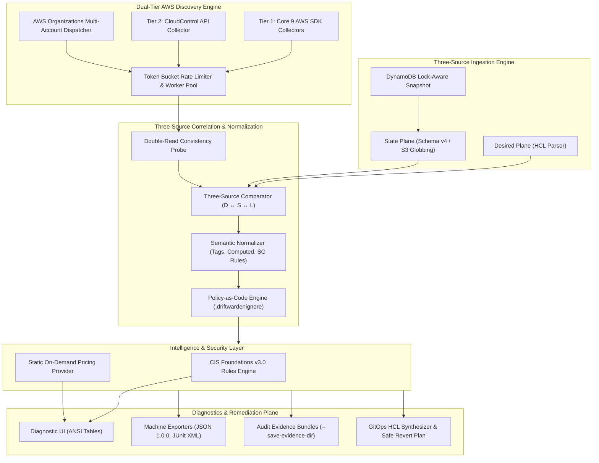
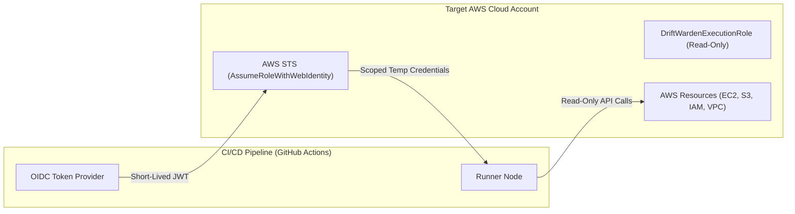

# DriftWarden Architecture & System Design

DriftWarden is an enterprise-grade AWS cloud infrastructure drift detection, security compliance, and reconciliation engine built in Go 1.23+.

---

## 1. High-Level System Architecture

---

## 2. Three-Source Correlation Plane (D ↔ S ↔ L)

Unlike legacy tools that perform binary two-source comparisons (`State ↔ Live`), DriftWarden correlates across three distinct truth sources:

| Desired (HCL) | State (tfstate) | Live (AWS) | Classification | Explanation |
|---|---|---|---|---|
| **$X$** | **$X$** | **$X$** | `IN_SYNC` | Perfect alignment across all planes. |
| **$X$** | **$X$** | **$Y$** | `ATTRIBUTE_DRIFT` | Out-of-band cloud mutation made directly in AWS console or CLI. |
| **$Y$** | **$X$** | **$X$** | `UNAPPLIED_CONFIG_DRIFT` | Code changed in Git/HCL but `terraform apply` was never executed. |
| **$Z$** | **$X$** | **$Y$** | `SPLIT_BRAIN_DRIFT` | Concurrent divergence: Git has new code while AWS suffered rogue mutation. |
| $\emptyset$ | $\emptyset$ | **$X$** | `SHADOW_RESOURCE` | Rogue untracked cloud asset provisioned outside Terraform. |
| **$X$** | **$X$** | $\emptyset$ | `GHOST_RESOURCE` | Resource exists in state/code but was deleted in live cloud. |

---

## 3. Trust Boundaries & Security Model

### Security Guardrails
1. **Strict Read-Only Guarantee**: DriftWarden only invokes Describe, List, and Get APIs. Zero mutating or destructive API calls are ever executed by the binary.
2. **AccessDenied Invariant**: Permission errors (`ErrAccessDenied`) are strictly quarantined as `PARTIAL_SCAN` and never misclassified as `ErrNotFound` (preventing false ghost resource alerts).
3. **Sensitive Attribute Masking**: Passwords, private keys, and tokens are masked with `[REDACTED_SENSITIVE]` and compared via existence verification without logging secrets.
4. **Shell Script Safety Boundary**: Generated `revert.sh` scripts never use `eval`, default strictly to echo-only dry-run, and require human review with `--execute`.
